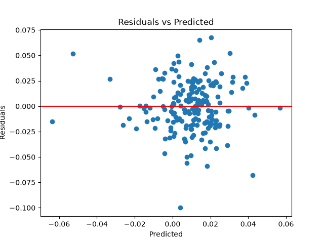
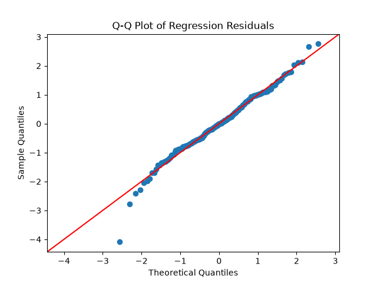
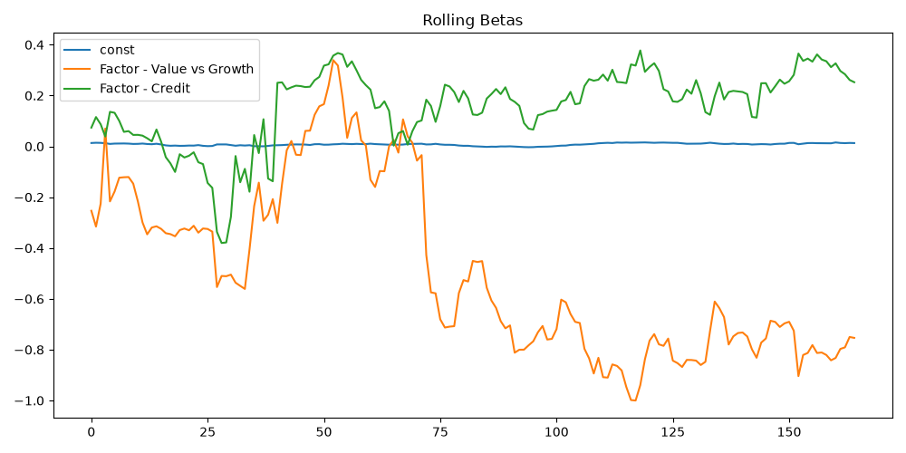

# Question 2 - Hedge Fund Analysis

## Data Preparation
Before analysing, the data was cleaned on input by removing observations where factor values exceeded a magnitude threshold (|x| > 2). These observations were treated as potential outliers and excluded to ensure integrity of analysis going forward.

## Q2.1. Multilinear Regression Model
A multilinear regression model was fitted using Ordinary Least Squares (OLS) to estimate the relationship between fund returns and risk factors. The dependent variable was the fund return series,  while the independent variables were the provided factor returns. 
The regression specification was: 
$$R_t = \alpha + \beta_1F_{1, t}+\beta_2F_{2, t}+\ldots + \beta_nF_{n, t}+\epsilon_t$$
where $R_t$ represents hedge fund returns, $\alpha$ represents fund alpha, $\beta_i$ represents exposure to each factor, and $\epsilon_t$ represents unexplained return.  
### Significant Results
| Variable | Beta | p-value |
| --------------- | --------------- | --------------- |
| Alpha | 0.0102 | 0.000 |
| Value vs Growth | -0.5729 | <0.001 |
| Credit | 0.2419 | 0.011 |
### Model Selection
After  fitting the full model, the statistical significance of factor exposures was assessed by their p-values at a 5% significance level. 
A reduced model was therefore fitted using only these factors to avoid including variables that provide limited explanatory power.
| Model  | Adjusted $R^2$ | AIC |
| --------------- |  --------------- | --------------- |
| Full model  | 0.255 | -842.7 |
| Reduced model  | 0.267 | -860.6 |

Although the full model achieves a higher $R^2$, the reduced model produced a higher **adjusted** $R^2$ and a lower AIC. This suggests that, within this sample period, removing insignificant factors improves model efficiency by reducing unnecessary complexity. 

The final model used in further analysis is therefore the reduced model:
$$R_t = 0.0093 - 0.5717F_{Value,t} + 0.1440F_{Credit,t} + \epsilon_t$$
where $F_{Value,t}$ and $F_{Credit,t}$ represent the Value vs Growth and Credit
factor returns respectively.

The positive alpha suggests the fund generated returns beyond what can be explained by its factor exposures, although this does not definitively prove manager skill as the estimate is sample dependent. 

## Q2.2. Model Evaluation
| Metric   | Value    |
|--------------- | --------------- |
| $R^2$   | 0.275   |
| Adjusted R^2   | 0.267   |
| F-statistic   | 35.20   |
| F-test p-value   | <0.001   |
| Jaque-Bera test | 0.019 |

The model achieved an $R^2$ of 0.275, meaning that approximately 27.5% of the variation in fund returns is explained by the selected factors. The remaining unexplained variation may represent manager skill, security selection, timing ability, or omitted risk factors.  

The F-test was statistically significant (p < 0.001) indicating that the model provides meaningful explanatory power. 

The Jaque-Bera test (p = 0.019) suggests mild departure from normality in the residuals, which is common in financial returns data. 

Residuals were examined to evaluate model assumptions. The residuals appear centred around zero with no clean non-linear pattern, supporting the use of a linear regression model. 

The Breusch-Pagan test return p=0.953, providing no evidence of heteroskedasticity. Residual variance appears consistent across the sample period, supporting the use of standard errors.
The Q-Q plot shows residuals closely following the theoretical normal distribution across most of the range, with soe deviation in the lower tail. This is consistent with the Jarque-Bera result and is typical of financial returns data where extreme negative events occur more frequently than a normal distribution would predict. 

## Q2.3. Strategy Comparison
To investigate whether investing directly in the hedge fund was more profitable than replicating its factor exposure, a factor portfolio was constructed using the estimated betas from the reduced model.
$$R_factor = -0.5717F_{Value,t} + 0.1440F_{Credit,t} + \epsilon_t$$
Alpha was excluded because an independent investor cannot directly buy the manager's alpha.

The performance of both strategies was evaluated using the Sharpe ratio:
$$Sharpe = \frac{R}{\sigma}$$
where $R$ represents the average return and $\sigma$ represents return volatility. A risk-free rate of zero was assumed. 

| Strategy | Average Return | Volatility | Sharpe Ratio |
|---|---:|---:|---:|
| Hedge Fund | 0.0096 | 0.0288 | 0.335 |
| Factor Portfolio | 0.0003 | 0.0151 | 0.021 |

The hedge fund achieved a significantly higher Sharpe ratio than the factor portfolio. This indicated that the hedge fund generated higher risk-adjusted returns than simply investing in underlying factors 

This difference is consistent with the regression results, where the hedge fund displayed a positive and statistically significant alpha. The factor portfolio captures the systematic exposure to Value vs Growth and Credit factor but does not capture the additional return represented by alpha. 

Since alpha is positive and large enough, the fund remains superior before considering initial fees. 
## Q2.4. Risk Comparison
Risk was evaluated using annualise volatility and maximum drawdown. 
| Metric | Hedge Fund | Factor Portfolio |
| --------------- | --------------- | --------------- |
| Annualised Volatility | 0.0997 | 0.0522 |
| Maximum Drawdown | -0.1401 | -0.1731 |

The hedge fund exhibited higher volatility, indicating greater variation in returns over time compared to the factor portfolio. However, the factor portfolio experienced a larger maximum drawdown, suggesting greater downside risk during periods of market stress. 

This indicates that the two strategies differ in the type of risk they exhibit: the hedge fund is more volatile on a day-to-day basis, whereas the factor portfolio is more exposed to severe peak-to-trough losses. 

Therefore, risk is not dominated by a single strategy and depends whether volatility or downside risk is prioritised.

## Q2.5. Beta Stationarity
Rolling regressions were used to assess whether factor betas are stable over time. 

The plots show that both Value vs Growth and Credit betas vary materially over time, with Value vs Growth exhibiting particularly large swings and an extended period of strongly negative exposure. In contrast the Credit beta fluctuates but remains more stable, while alpha remains relatively constant. 

This instability implied that factor exposures are not stationary and that the fund's risk profile changes materially through time. In risk terms, this means that static betas from Q2.1. only capture *average* exposure and may misrepresent the fund's true risk at any given point in time. 

ADF tests were conducted on each rolling beta series to formally assess stationarity.

| Factor | ADF p-value | Conclusion |
|---|---|---|
| Value vs Growth | 0.528 | Non-stationary |
| Credit | 0.076 | Non-stationary |

Both betas fail to reject the null hypothesis at the 5% level, confirming that factor 
exposures are non-stationary. Static betas from the reduced model therefore represent 
average exposure only, and may misrepresent the fund's true risk profile at any given 
point in time.
